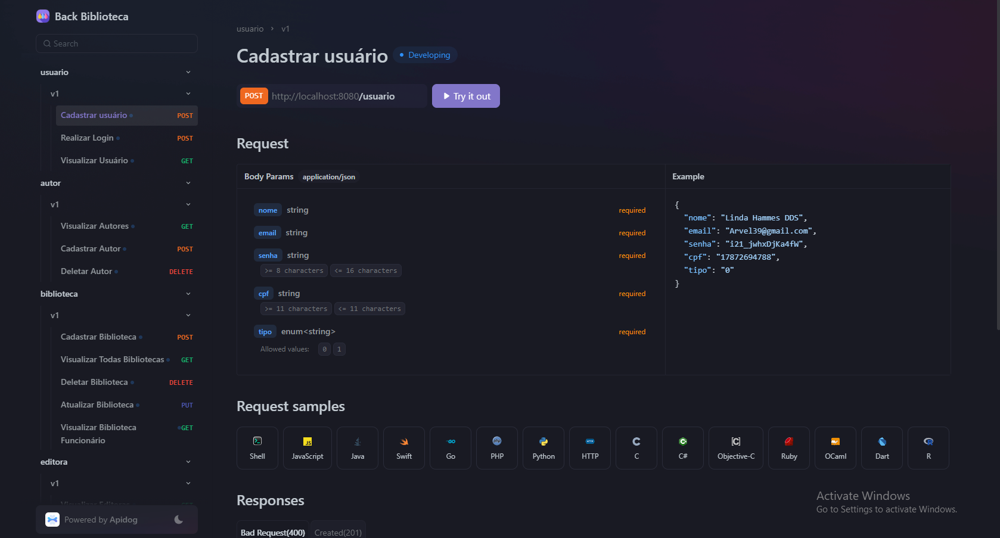

# Gerenciador de Bibliotecas 📗


## Descrição ✏️

Back-Biblioteca-Final é o backend de uma aplicação voltada para a gestão de bibliotecas e livrarias, permitindo o empréstimo e a compra de livros.
O sistema possui dois tipos de usuários:

- **Cliente**: pode visualizar bibliotecas e seus livros, escolhendo entre comprar ou pegar um livro emprestado.
- **Funcionário**: responsável por cadastrar bibliotecas, livros e autores, além de gerenciar os empréstimos.

## Estrutura do Projeto 🏗️

```

└───backbibliotecafinal/
    ├───client/
    ├───constants/
    │   ├───enums/
    │   └───messages/
    ├───controller/
    ├───dto/
    │   ├───request/
    │   │   ├───autor/
    │   │   ├───biblioteca/
    │   │   ├───editora/
    │   │   ├───livro/
    │   │   ├───transacao/
    │   │   └───usuario/
    │   └───response/
    ├───entity/
    ├───handler/
    │   └───exceptions/
    ├───repository/
    ├───security/
    ├───service/
    ├───utils/
    │   ├───helper/
    │   └───mapper/
    └───validations/

```

## Tecnologias Utilizadas 🔧

- **Java 17**
- **Spring Boot 3.3.8**
- **Spring Data JPA**
- **H2 Database** (banco de dados em memória para testes)
- **Spring Security & JWT** (autenticação)
- **Spring OpenFeign** (clientes HTTP)
- **Swagger (SpringDoc OpenAPI)** (documentação da API)
- **Lombok** (redução de boilerplate)
- **MapStruct** (mapeamento de objetos DTO)
- **Jackson Databind** (serialização/deserialização de JSON)

## Configuração e Instalação ⚙️

### Requisitos

- **Java 17** ou superior
- **Maven 3.8+**

### Passos para rodar o projeto localmente 🔨

1. Clone o repositório:
   ```sh
   git clone https://github.com/Matheusvgdr/back-projeto-final.git
   ```
2. Acesse o diretório do projeto:
   ```sh
   cd back-biblioteca-final
   ```
3. Compile e execute o projeto:
   ```sh
   mvn spring-boot:run
   ```

O backend estará rodando em `http://localhost:8080`

## Passos para a utilização do Spring OpenFeign no backend 🔗

   Utilizar o arquivo chamado [db.json](database/db.json) que está no diretório database, na raiz do projeto

1. Instalar o Angular, ou qualquer ferramenta que utilize o node
   ```sh
   npm install -g @angular/cli
   ```
2. Criação do projeto
   ```sh
   ng new nome-do-projeto
   ```
3. Instalação do json-server

   ```sh
   npm install json-server
   ```
4. Execução do json-server

   ```sh
   npx json-server db.json
   ```

## Documentação da API 📃

A documentação das APIs está disponível em:

```sh
https://www.apidog.com/apidoc/shared-a1a38930-5881-4f64-9957-ec26261d6b5d
```

Se o Swagger estiver ativado, a documentação também pode ser acessada localmente:

```
http://localhost:8080/swagger-ui/index.html
```

## Contribuição 🤝

Pull requests são bem-vindos! Para mudanças maiores, abra uma issue primeiro para discutirmos.


